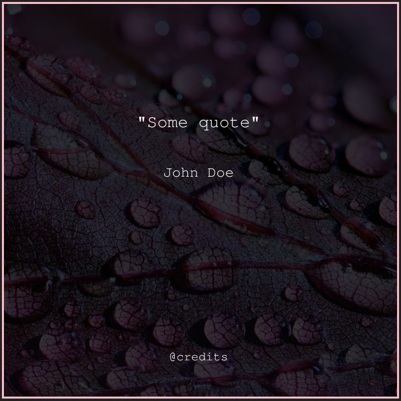

# quote-api
Simple quote image creation API

## Usage

### Server
Add a selection of PNG/JPG images to `quote-api/images`, then:

```bash
pip3 install -r requirements.txt
flask run
```

### Client
Make a `POST` request to the `/quote/` endpoint, with a JSON body containing the following fields:

```json
{
  "quote":"Quote Here",
  "author": "Author",
  "border_color": "#fff",
  "credits": "@credits"
}
```

Only `author` is obligatory.

### Output


